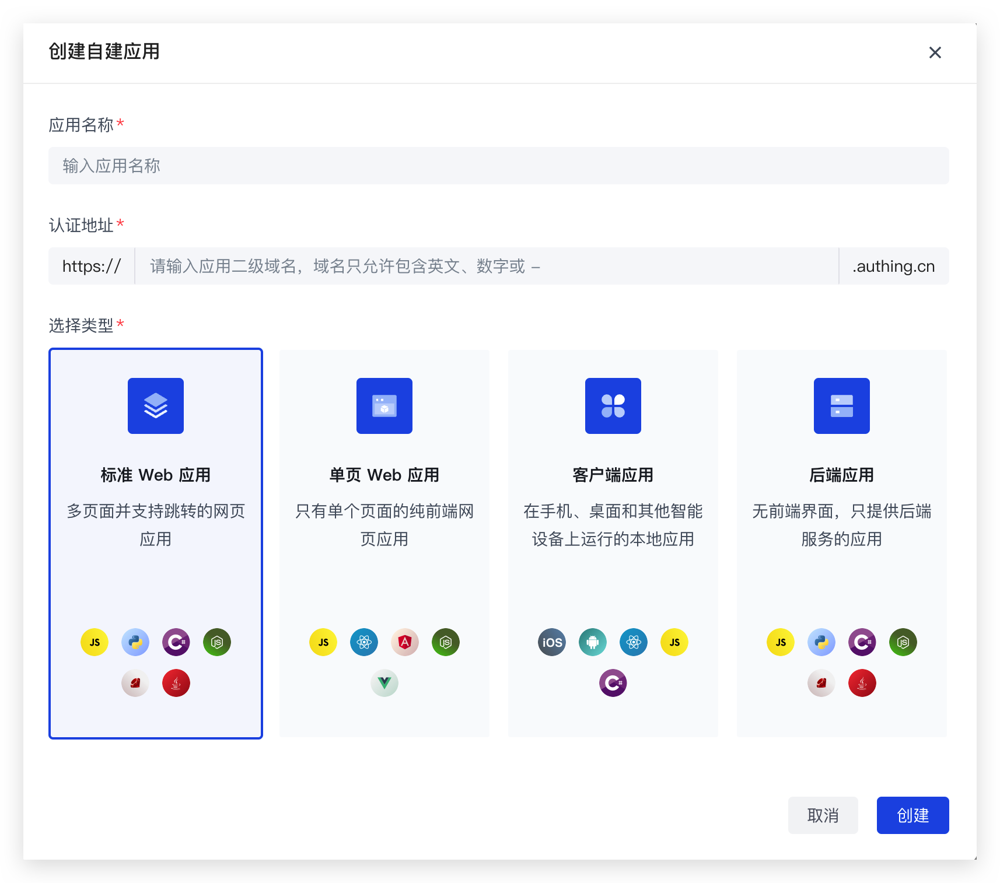

# Java SpringBoot 快速开始

本教程讲述在 SpringBoot 框架下处理用户登录、检查登录状态、获取用户信息、登出的方式。


环境要求：

- SpringBoot: 2.4 及以上
- Java: jdk 1.8 及以上


在这篇教程中，我们会将 Authing 提供的 Java SDK 接入一个新建的 SpringBoot 项目，包含以下内容：

- 演示如何进行登录/注册；
- 演示如何获取用户信息；
- 演示如何和 Session 机制结合；
- 演示如何使用 Access Token 对接口进行登录鉴权保护；
- 演示如何对一个接口进行细粒度的权限控制保护；
- 演示如何使用 Refresh Token 换取新的 Access Token；
- 演示如何退出登录。


## 配置 Authing

### 创建应用

你需要先在 Authing 创建一个应用。进入[**控制台**](https://console.authing.cn) > **应用**，点击右上角的「创建自建应用」。


**应用名称**可以随意填写。

**认证地址**需填入自定义的域名，但不可与 Authing 数据库中的重复。填写后，会拼接成一段 URL 作为这个应用在 Authing 的唯一标识。

**应用类型**可以随意选择，此处以最常用的「标准 Web 应用」为例。



### 配置应用

在应用列表找到你的应用，单击进入应用详情。在应用详情页面上方的导航栏中单击「应用配置」，进入配置界面。

向下滑动找到「认证配置」卡片，在**登录回调 URL**栏填入 `http://localhost:8080/callback` 。当用户在 Authing 完成认证后，Authing 会将用户重定向到该回调地址；在**登出回调 URL**栏填入 `http://www.baidu.com` 。当用户在 Authing 完成退出后，Authing 会将用户重定向到登出回调地址。


配置完成后，不要忘记**单击对应的「保存」按钮**保存你的设置。

### 记录应用信息

记录以下信息：

- 应用 ID
- 应用密钥
- 应用域名

如何获取：https://docs.authing.cn/v2/guides/faqs/get-app-id-and-secret.html


## 建立 Spring Boot 项目

### 在线创建项目
访问 [Spring Initializr](https://start.spring.io/) ，参考图中配置创建 Spring Boot 项目：


### 本地创建项目
本地打开 IDEA，参考图中配置创建 Spring Boot 项目：


为简洁起见，上述两种方法只添加了基础的 Spring MVC 依赖项，其它依赖项可按需添加。

Java 语言版本也可以按需选择，示例代码中使用版本 8。


## 集成 Authing SDK

打开项目根目录的 pom.xml 文件，在 dependencies 标签下加入如下依赖项：

```xml
<dependency>
	<groupId>cn.authing</groupId>
	<artifactId>authing-java-sdk</artifactId>
	<version>{{LATEST_VERSION}}</version>
</dependency>
```

其中最新的版本号 LATEST_VERSION 可根据 groupId和artifactId 在 [Maven 仓库](https://search.maven.org/artifact/cn.authing/java-core) 找到。

在 properties 标签下加入如下配置项：
> 由于 spring 依赖的 OkHttp 版本过低，所以你需要手动指定一下 OkHttp 的版本。

```xml
<properties>
    <okhttp3.version>4.8.0</okhttp3.version>
</properties>
```

保存文件，大多数 IDE 会自动从 Maven 仓库拉取依赖项。也可以在项目根目录执行以下命令来手动获取依赖项：

```shell
mvn dependency:resolve
```


## 初始化 AuthenticationClient

Authing Java SDK 在 AuthenticationClient 类中封装了和用户登录相关的方法，这里我们将其作为一个 Bean 存放到 Spring 容器中。

创建一个**配置类**，或者在你的 Main Class（示例中是 AuthingJavaDemoApplication）中添加如下方法：

```java
@Configuration
public class AuthingConfig {
  @Bean
  @Scope("prototype")
  public AuthenticationClient authenticationClient() throws IOException, ParseException {
    //在构造函数中分别填入自己的 App ID、App Secret、APP Host。
    AuthenticationClientOptions options = new AuthenticationClientOptions();
    options.setAppId("YOUR_APP_ID");
    options.setAppSecret("YOUR_APP_SECRET");
    options.setAppHost("YOUR_APP_HOST");
    AuthenticationClient client = new AuthenticationClient(options);
    return client;
  }
}
```

AuthenticationClient 类要求每次调用初始化新实例，因此要将其作用域设为 prototype。关于如何获取App ID、App Secret 和 APP Host，前文已经说明。


## 编写控制器

### 添加控制器

在项目主启动类同级目录内添加一个控制器，并注入相关依赖：

```java
// import 语句请自行添加

@Controller
public class DemoController {

    public static final String KEY_ACCESS_TOKEN = "access_token";
    public static final String KEY_ID_TOKEN = "id_token";
    public static final String KEY_REFRESH_TOKEN = "refresh_token";

    private final HttpSession session;
    private final ObjectFactory<AuthenticationClient> authClientFactory;

    public DemoController(HttpSession session, ObjectFactory<AuthenticationClient> authClientFactory) {
        this.session = session;
        this.authClientFactory = authClientFactory;
    }

   	// 在这里添加路由方法……

}
```


### 添加认证能力

为了给应用添加认证能力，需要监听三个路由：**登录**、**回调**、**登出**。

#### 发起登录

在这里我们使用  `authClientFactory.getObject()` 获取 `AuthenticationClient` ，再调用其 `buildAuthorizeUrl` 方法构建一个登录地址。

之后的文档对于如何获取 `AuthenticationClien` 不再详细描述

监听 `/login` 端点，当你访问 http://localhost:8080/login 时，你会被重定向到 Authing 完成认证。

```java
    @GetMapping("/login")
    public String login() {
        IOidcParams iOidcParams = new IOidcParams();
        iOidcParams.setRedirectUri("http://localhost:8080/callback");
        return "redirect:" + authClientFactory.getObject().buildAuthorizeUrl(iOidcParams);
    }
```

效果如下：


用户在此可以使用任何你的应用支持的登录/注册方式进行登录/注册，你可以[阅读此文档](https://docs.authing.co/v2/guides/app-new/create-app/)了解如何为你的应用自定义样式、配置社会化登录、配置 MFA 等。

当用户登录之后，浏览器会**处理回调**。

#### 处理回调

监听 `/callback` 端点，当你在 Authing 完成认证后，Authing 会将你重定向到回调地址，在 URL 中会携带一次性的临时凭证 `code`。在回调地址可以根据 `code` 获取用户信息并存放在 session 中，随后将你重定向到应用的其他页面。

在这里你会接触几个术语：

- `access_token`: `access_token` 相当于**钥匙**，代表了用户访问你的业务接口或者 Authing 接口时需要提供的访问凭证。
- `id_token`: `access_token` 相当于身份证，包含了用户的一些基本个人资料。
- `refresh_token`: 当 `access_token` 过期时，可以使用 `refresh_token` 换取新的 `access_token`，从而在保证安全性的前提下，实现长期保持用户登录态无需用户再次登录的功能。

需要注意的，**用户请求你业务系统的 API 或者 Authing 的 API 时，应该使用 `access_token` 而不是 `id_token`！**

```java
    @GetMapping("/callback")
    @SuppressWarnings("unchecked")
    public String callback(@RequestParam String code) throws Exception {
        // 注意：一个 code 只能被消费一次
        OIDCTokenResponse oidcTokenResponse = authClientFactory.getObject().getAccessTokenByCode(code);
        // 将请求回应设置到本地 session 中
        session.setAttribute(KEY_ACCESS_TOKEN, oidcTokenResponse.getAccessToken());
        session.setAttribute(KEY_ID_TOKEN, oidcTokenResponse.getIdToken());
        session.setAttribute(KEY_REFRESH_TOKEN, oidcTokenResponse.getRefreshToken());

        // 设置用户登录态
        authClientFactory.getObject().setAccessToken(
          (String) session.getAttribute(KEY_ACCESS_TOKEN));
        return "redirect:/index";
    }
```

此处回调到 index 页面，效果如下：


#### 登出

监听 `/logout` 端点，当你访问 http://localhost:8080/logout 时，清除你的 session，随后将你重定向到 Authing 完成登出。

```java
    @GetMapping("/logout")
    public String logout() {
        String idToken = (String) session.getAttribute(KEY_ID_TOKEN);
        // 用户当前未登录
        if(idToken == null) {
            return "redirect:/error";
        }

        // 撤回 accessToken
        if(StrUtil.isNotBlank((String) session.getAttribute(KEY_ACCESS_TOKEN))) {
            authClientFactory.getObject().revokeToken((String) session.getAttribute(KEY_ACCESS_TOKEN));
        }
        // 清空 session
        session.invalidate();

        BuildLogoutUrlParams params = new BuildLogoutUrlParams();
        // 设置登出回调（要与控制台保持一致）
        params.setPostLogoutRedirectUri("http://localhost:8080/error");
        params.setIdTokenHint(idToken);

        String logoutUrl = "";

        try {
            logoutUrl = authClientFactory.getObject().buildLogoutUrl(params);
        } catch (Exception e) {
            e.printStackTrace();
        }

        return "redirect:" + logoutUrl;
    }
```

此处设置回调到 error 页面，效果如下：


### 展示用户信息

为了能够展示用户信息，你的应用需要一个受保护的路由。只有登录的用户可以访问，并看到自己的信息。此处直接展示到页面上。

>  出于减少网络传输请求的考虑，你也可以选择在本地校验 `access_token` 的合法性（使用 `introspect_token_offline` 方法）。**采取这种方式时，需要你在应用端做好 access_token 的销毁工作，当用户主动退出登录之后，需要将 session 或者浏览器/客户端缓存的 access_token 清除。** 因为用户主动退出登录时，`access_token` 本身签名的过期时间还是没到的，只有通过在线校验才能真正判断其合法性，所以需要你在用户主动退出时务必将 session 或者浏览器/客户端缓存的 `access_token` 清除。

```java
@ResponseBody
    @GetMapping("/profile")
    public String profile(){
        String accessToken = (String) session.getAttribute(KEY_ACCESS_TOKEN);
        if(StrUtil.isBlank(accessToken)) {
            return "未登录";
        }

        IntrospectTokenWithClientSecretPostRespDto res =
                authClientFactory.getObject().introspectToken(accessToken);
        if(!res.getActive()){
            return "accessToken 已失效";
        }

        return authClientFactory.getObject()
          				.getUserInfoByAccessToken(accessToken).toString();
    }
```


### 实现一个要求用户具备特定权限的 API

在这里我们简单得修改一下 `/login` 端点，我们加入一个自定义的 `scope` —— `ecs:Start`（代表了启动 ECS 服务器的权限）。

> `scope` 的含义是用户的 `access_token` 具备哪些权限项，我们通过检验 `access_token` 的 `scope`，就可以判断用户是否具备某个特定的权限。

<details>
<summary><strong>点此展开如何在 Authing 控制台中进行必要配置</strong></summary>
  <p>首先，创建一个资源</p>
  </img>
	<p>具体配置如下图所示：</p>
  </img>
  <p>然后，配置授权</p>
  </img>
  <p>具体配置如下图所示：</p>
  </img>
</details>


配置完成后，回到后台 login，设置 scope：

```java
    @GetMapping("/login")
    public String login() {
        IOidcParams iOidcParams = new IOidcParams();
        iOidcParams.setRedirectUri("http://localhost:8080/callback");
        // 此处权限要在默认权限后用空格分隔，添加
        iOidcParams.setScope("openid profile email phone address ecs:Start");
        return "redirect:" + authClientFactory.getObject()
          						.buildAuthorizeUrl(iOidcParams);
    }
```

重启应用，退出登录之后再次点击登录，用户的 `access_token` 权限项中将会多一项 `ecs:Start`。

接下来继续实现一个要求用户具备特定权限的 API，我们进行了下面几步操作：

1. 由 Session 中 `access_token` 判断用户是否登录。
2. 从 Session 中取出 `access_token`，调用 AuthenticationClient 的 `introspectToken` 方法，在线验证 `access_token` 的合法性。
3. 从 `access_token` 解析出的 `IntrospectTokenWithClientSecretPostRespDto` 中，获取`scope` 字段，然后我们判断其中是否包含了 `ecs:Start` 这一项。

> 同上，出于减少网络传输请求的考虑，你也可以选择在本地校验 `access_token` 的合法性（使用 `introspect_token_offline` 方法）。

```java
    @GetMapping("/checkScope")
    @ResponseBody
    public String checkScope(){
        String accessToken = (String) session.getAttribute(KEY_ACCESS_TOKEN);
        if(StrUtil.isBlank(accessToken)) {
            return "未登录";
        }

        IntrospectTokenWithClientSecretPostRespDto res =
                authClientFactory.getObject().introspectToken(accessToken);
        if(!res.getActive()){
            return "accessToken 已失效";
        }

        // 查找返回结果类中的权限字符串是否包含你所设定的权限
        if(StrUtil.contains(res.getScope(),"ecs:Start")){
            return "你拥有该权限";
        }else {
            return "你没有该权限";
        }
    }
```


### 实现使用 refresh_token 换取新的 access_token 功能

在上一步中，你可能会思考：如果用户的 `access_token` 快要过期了，我怎么能在不要求用户重新登录的情况下继续保持登录态？这个时候，`refresh_token` 就派上用场了。

当用户的 `access_token` 过期时，可以使用 `refresh_token` 换取新的 `access_token`，从而在保证安全性的前提下，实现长期保持用户登录态无需用户再次登录的功能。

由于我们在之前的步骤中将 `refresh_token` 写入到了 Session 中，所以我们可以在 `session` 拿出 `refresh_token`。

之后我们调用 `AuthenticationClient` 的 `getNewAccessTokenByRefreshToken` 方法换取新的 `access_token`, `id_token` 和 `refresh_token`，并将这些信息更新到 Session 中。

```java
    @GetMapping("/refresh")
    public String refresh(){
        String accessToken = (String) session.getAttribute(KEY_ACCESS_TOKEN);
        if(StrUtil.isBlank(accessToken)) {
            return "未登录";
        }
        // 用 refreshToken 换 newAccessToken
        GetNewAccessTokenByRefreshTokenRespDto newAccessToken =
                authClientFactory.getObject().getNewAccessTokenByRefreshToken((String) session.getAttribute(KEY_REFRESH_TOKEN));

        // 重新设置 session
        session.setAttribute(KEY_ACCESS_TOKEN, newAccessToken.getAccessToken());
        session.setAttribute(KEY_ID_TOKEN, newAccessToken.getIdToken());
        session.setAttribute(KEY_REFRESH_TOKEN, newAccessToken.getRefreshToken());

        // 设置用户登录态
        authClientFactory.getObject().setAccessToken((String) session.getAttribute(KEY_ACCESS_TOKEN));

        return "redirect:/index";
    }
```


## 接下来

到目前为止，我们的所有功能都已经全部实现了，接下来你可以了解更多：

1. 在这个项目中，我们使用的是 Authing 在线的托管登录页，我们也提供 [React, Vue, Angular 以及原生 JS 的登录组件 —— Guard](https://docs.authing.co/v2/reference/guard/v2/)，你可以在你的系统中集成该组件，功能和托管登录页完全一致。你也可以选择自建登录页面，我们 Java SDK 内置了发送短信、注册、手机号验证码登录等方法，可以让你在自建的登录页面中实现 Authing 登录页/组件一样的功能。
2. 你可以[阅读此文档](https://docs.authing.co/v2/guides/app-new/create-app/)了解如何为你的应用自定义样式、配置社会化登录、配置 MFA 等。
3. 如果你有多个系统，需要在不同的站点中实现单点登录效果，可以阅读文档[如何实现单点登录 SSO](https://docs.authing.co/v2/reference/sdk-for-sso-spa.html)。


## 获取帮助

如果对于此 Demo 有任何疑问，可访问[官方论坛](https://forum.authing.cn/). 此仓库的 issue 仅用于上报 Bug 和提交新功能特性。
